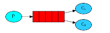
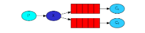
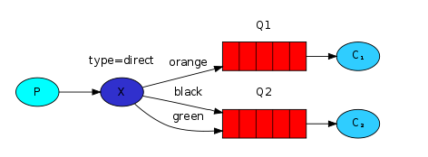
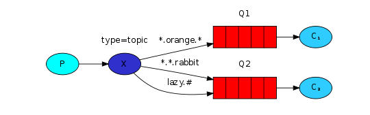
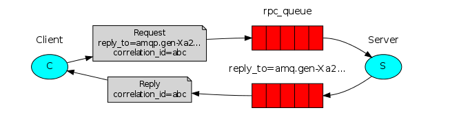

### 官网实例地址：
https://www.rabbitmq.com/getstarted.html
### sample-01 简单队列

### sample-02 工作队列

### sample-03 发布订阅

### sample-04 路由模式

### sample-05 主题模式

### sample-06 RPC模式

### sample-07 发布者确认模式

